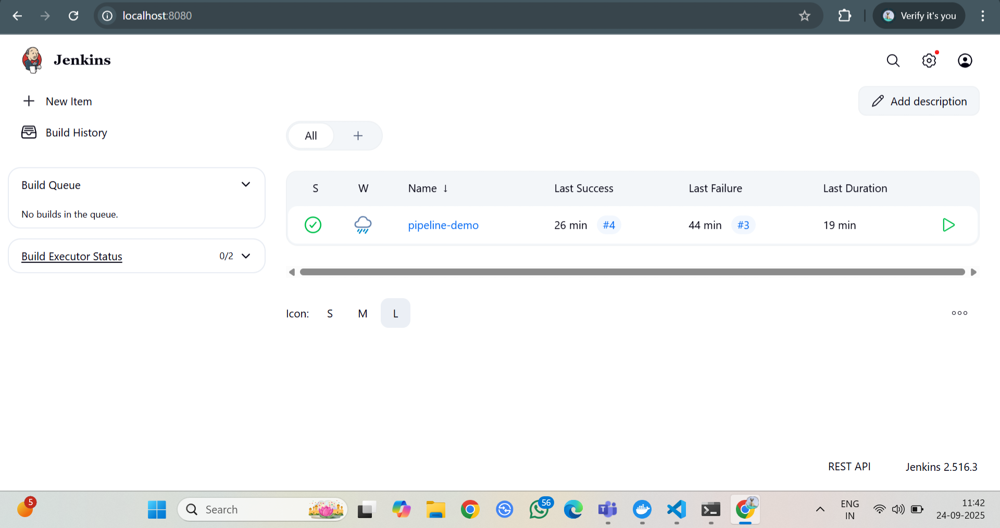
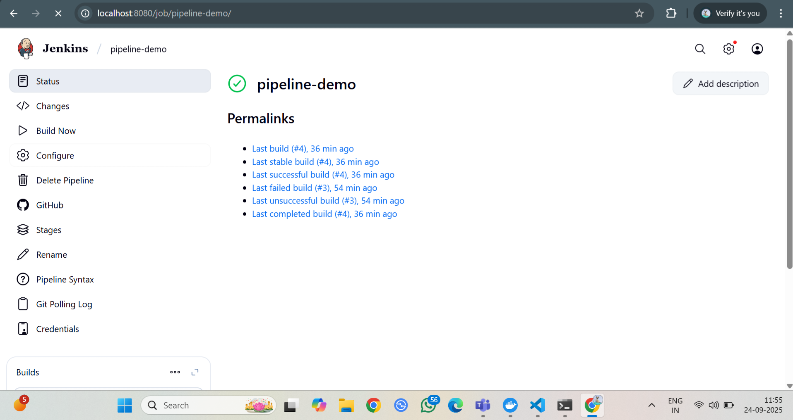
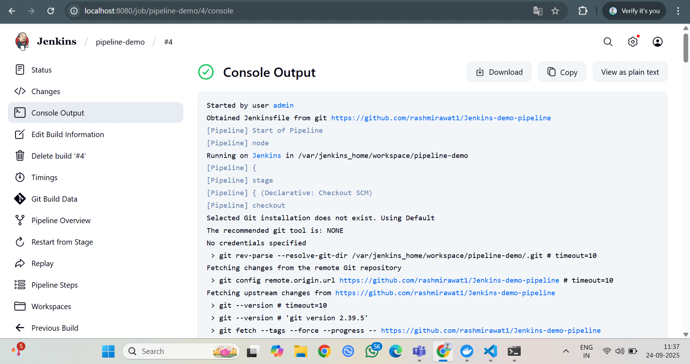

## Project Overview
This repository contains the implementation of setting up a basic Jenkins pipeline to automate the building and deploying of a sample Python application using Jenkins and Docker.

### Objective
Set up a basic Jenkins pipeline to automate the process of building and deploying an application.

### Tools
- Jenkins
- Docker

## Implementation Details

### Setup Process
1. *Environment Setup*:
   - Installed Docker Desktop on Windows with WSL2 (Ubuntu) integration.
   - Built a custom Jenkins Docker image (custom-jenkins-docker) with a Dockerfile to include the Docker CLI and mounted the WSL Docker socket (/var/run/docker.sock).

2. *Application Structure*:
   - Developed a sample Python application (app.py) with a test file (test_app.py) using pytest.
   - Created a Dockerfile to containerize the application.
   - Wrote a Jenkinsfile with Build, Test, and Deploy stages.

3. *Jenkins Configuration*:
   - Configured a pipeline job in Jenkins to fetch the Jenkinsfile from this repository.
   - Resolved permission issues by adjusting the container's user group to match the docker group.
   - Set up a GitHub webhook to trigger the pipeline automatically on each push to the main branch.

4. *Testing*:
   - Tested the pipeline manually and automatically by pushing changes to the repository.
   - Verified successful builds and deployments via the Jenkins dashboard.

### Files
- app.py: Sample Python application.
- test_app.py: Test file for the application.
- requirements.txt: Dependencies for the Python environment.
- Dockerfile: Configuration to build the application container.
- Jenkinsfile: Defines the CI/CD pipeline stages (Build, Test, Deploy).

## 📸 Screenshots

### ✅ Successful Pipeline Run

## Learnings
- Gained practical experience in configuring a CI/CD pipeline with Jenkins and Docker.
- Learned to troubleshoot Docker socket permissions and set up automated triggers with GitHub webhooks.
- Understood the integration of version control with DevOps workflows.

